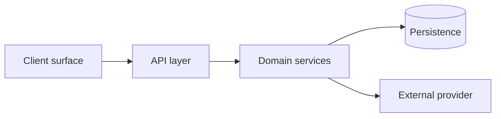

# SYSTEM MAP — Agada Tech Platform

**What exists, not what was planned.** This file and `schema.dbml` record the system's **current state**. Where this project has a `product/` workspace, `product/DATA_MODEL.md` records **intent** — what was decided. The two are allowed to differ — the difference is information (what the system became versus what was designed), not staleness to paper over.

Every other structural doc in this project is a **list**: a directory tree, a layer table, an endpoint table. This one is about the **edges** — what the pieces are and how they reach each other. Keep it at that altitude: components and their relationships, never a file-by-file mirror of the source tree (code paths are declared in [`STACK.md`](./STACK.md)).

Owned by the engineering side(s) — see the [permission table](./WORKFLOW.md#the-permission-table--canonical-for-what). Updated as part of the work that changes it, not in a separate pass.

---

## Modules

_<Replace with this system's real components. Keep node names to what a person would say out loud.>_

## Components

| Component | Responsibility | Depends on |
|---|---|---|
| _<name>_ | _<one line — what it is answerable for>_ | _<the components it calls>_ |

> One row per node above. If a component's responsibility needs two sentences, it is probably two components.

## Seams

_<Where this system is deliberately cut, and which of those cuts are load-bearing.>_

A seam is a boundary you could replace across without touching the other side — a provider swapped, a surface added, a service extracted. Record **why** each one exists; a seam whose reason is forgotten gets collapsed by the next refactor.

| Seam | What it separates | Load-bearing? |
|---|---|---|
| _<name>_ | _<A from B>_ | _<yes — why / no — convenience only>_ |

## Entities

The current entity model is **`schema.dbml`** — generated, never hand-written. Regenerate it with the **Schema diagram** command in [`STACK.md`](./STACK.md) → Commands; it refreshes as part of the work that changes the model, before the review gate.

Render it by pasting into [dbdiagram.io](https://dbdiagram.io), or locally via the DBML CLI.

> **A project with no machine-readable schema to generate from ships no `schema.dbml`.** A missing diagram is honest; a hand-maintained one goes stale silently and is worse than nothing.

## Where it runs

_<If this project has an `infra/` workspace: point at `infra/INFRA.md` → Topology, and make it a link once you know the file is there. **Otherwise delete this section.**>_

Deployment topology is a **different graph** from the one above — where things run, not how the software is structured. A monolith is one deployment box and many modules. Keep them apart; cross-reference rather than merge.

---

_Current state. If this disagrees with the code, the code is right — fix this file in the same change._
