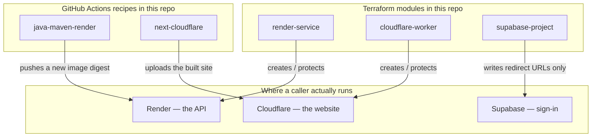

# Agada Tech Platform — Deployment & Infrastructure Architecture

The **overall** deployment picture — the system-level view no single side's README owns. Per-side local run/build stays in each side's README; this is how it all fits together in the real world.

## Topology

This repo is a library. It has no client, API, or database of its own. A product that uses it (for example VovoSpaces) runs in three places. Terraform creates or protects those places. GitHub Actions is what ships new code into two of them.

| Place | What the user hits | This library’s Terraform module | Who ships new code |
|---|---|---|---|
| Render | the API | `render-service` — one web service that pulls a Docker image | the `java-maven-render` workflow, by image digest |
| Cloudflare | the website | `cloudflare-worker` — the Worker’s name and `*.workers.dev` switch | the `next-cloudflare` workflow, via wrangler |
| Supabase | sign-in | `supabase-project` — which URLs may redirect after login | nobody here; the project already exists in the dashboard |

Terraform does **not** upload the API image or the website bundle. If it did, every deploy would look like drift. CI does that. Terraform also does **not** create the Supabase project — that would put the database password in state.

> **This is *where it runs* — a different graph from *how the software is structured*.** Module topology, dependencies and seams live in [`../SYSTEM_MAP.md`](../SYSTEM_MAP.md). Keep the two apart and cross-reference: a monolith is one deployment box and many modules, so merging them loses the second graph entirely.

## Hosting & platforms
| Concern | Choice | Notes |
|---|---|---|
| This repo | none | Public library when the GitHub repo exists. No service runs here. |
| Caller backend | Render, image from GHCR | `render-service` plus `java-maven-render`. Account and service id stay in the caller. |
| Caller frontend | Cloudflare Workers | `cloudflare-worker` plus `next-cloudflare`. Code is uploaded by wrangler, not Terraform. |
| Auth | existing Supabase project | `supabase-project` writes `site_url` and `uri_allow_list` only. The project itself is created in the dashboard. |

## Environments

None in this repo. A caller that uses the recipe today has one test server, built and deployed from `main`. A second environment is not an input on the recipe.

## Secrets & config

Names only. Values stay in each caller.

| Name | Class | Who sets it | Read by |
|---|---|---|---|
| `RENDER_API_KEY` | secret | caller Actions secret and Terraform env | `java-maven-render` deploy job; Render provider |
| `RENDER_SERVICE_ID` | identifier | caller Actions variable | `java-maven-render` deploy job |
| `RENDER_OWNER_ID` | identifier | caller Terraform env | Render provider |
| `GITHUB_TOKEN` | secret, per job | GitHub | image push and release retag |
| `DEPLOY_BACKEND` | config | caller variable, mapped to the `deploy` input | caller, not this repo |
| `CLOUDFLARE_DEPLOY_TOKEN` | secret | caller Actions secret | `next-cloudflare` deploy job (wrangler) |
| `CLOUDFLARE_API_TOKEN` | secret | caller Terraform env | Cloudflare provider. Not the wrangler OAuth login. |
| `NEXT_PUBLIC_SUPABASE_ANON_KEY` | public | caller Actions secret | `next-cloudflare` deploy build |
| `NEXT_PUBLIC_API_URL` | public | caller Actions variable | same |
| `NEXT_PUBLIC_SUPABASE_URL` | public | caller Actions variable | same |
| `CLOUDFLARE_ACCOUNT_ID` | identifier | caller Actions variable | same |
| `DEPLOY_FRONTEND` | config | caller variable, mapped to the `deploy` input | caller, not this repo |
| `SUPABASE_ACCESS_TOKEN` | secret | caller Terraform env | Supabase provider |

## CI/CD

- **Recipe:** `.github/workflows/java-maven-render.yml` (`workflow_call`). Jobs `backend` (`mvn verify`), `backend-image` (push to GHCR on a push to `main`), `backend-deploy` (Render, only when `deploy` is true). Deploy script: `infra/scripts/render-deploy.sh`, checked out from this repo so the caller does not copy it.
- **Release recipe:** `.github/workflows/java-maven-release.yml`. release-please in the caller, then retag `:sha-<commit>` to `:<version>`. No second image build.
- **Frontend recipe:** `.github/workflows/next-cloudflare.yml`. Jobs `frontend` (lint, test, build with presence-only Supabase placeholders) and `frontend-deploy` (matrix of Workers, only when `deploy` is true). Build-time `NEXT_PUBLIC_*` for a real deploy come from the caller. When both recipes run in one caller, that caller waits on the backend job.
- **Runner:** every recipe job runs on `ubuntu-26.04`, pinned. Not `ubuntu-latest`: that label moves under callers without a platform release. Moving to a newer image is a platform `v1.x` change.
- **Throwaway callers:** `.github/workflows/test-java-maven-render.yml` and `.github/workflows/test-next-cloudflare.yml`, both `deploy: false`.
- **Terraform modules:** `terraform/modules/{render-service,cloudflare-worker,supabase-project}`. Callers pin with `?ref=v1`. Validate only: `terraform init -backend=false && terraform validate` in `infra/fixtures/terraform-modules`.
- **Version:** [`CHANGELOG.md`](../CHANGELOG.md). Callers pin `@v1` / `?ref=v1`. Breaking input changes bump the major.
- **Onboard:** [`ONBOARDING.md`](../ONBOARDING.md) — two caller files and the secret/variable names, in order.
- **Apply:** this repo does not deploy a service and does not apply Terraform. Callers do. User-run here is creating the public GitHub repo, pushing `main`, and tagging `v1`.

## Ownership
**This side's agent owns this file** ([`ARCHITECT.md`](./ARCHITECT.md)) and updates it **in the same change** as the deployment-architecture decision it records (e.g. "frontend → Cloudflare Pages", "add a staging env"). Every other side **reads** it — this is where they learn where things run.

The running system is the source of truth here, not the reverse: read what is deployed before describing it, and where they disagree, this document is the thing that is wrong.

If a project has **no `infra/` directory**, don't create one just for this — the engineering side keeps deployment notes in its own README and `SESSION_LOG.md`, as before.

---

_Last Updated: 2026-10-05_
